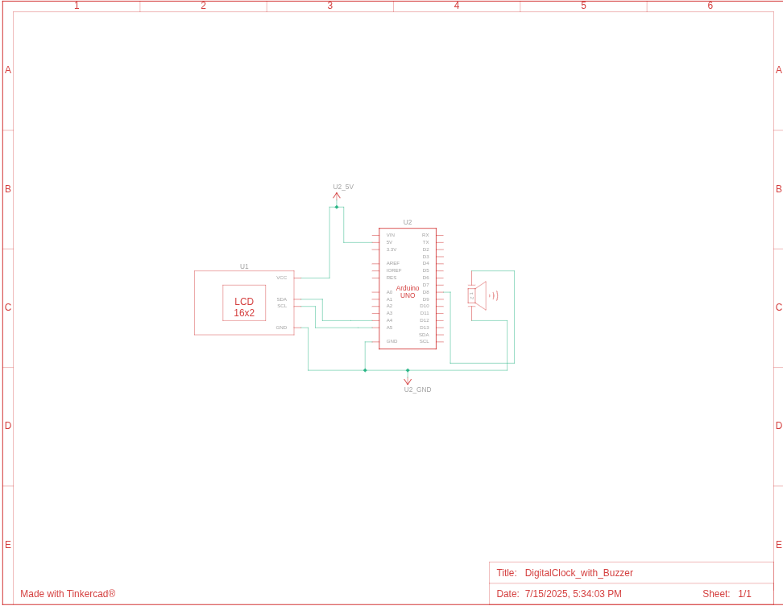

# Digital Clock with Arduino Uno

A fake digital clock project built with Arduino Uno featuring an alarm system. This project demonstrates basic timekeeping functionality using an LCD display and includes an audible alarm feature.

## 📋 Table of Contents
- [Overview](#overview)
- [Features](#features)
- [Components Required](#components-required)
- [Circuit Diagram](#circuit-diagram)
- [Installation](#installation)
- [Setup Instructions](#setup-instructions)
- [Usage](#usage)
- [Code Structure](#code-structure)
- [Library Dependencies](#library-dependencies)
- [Troubleshooting](#troubleshooting)
- [Contributing](#contributing)
- [License](#license)

## 🔍 Overview

This project creates a functional digital clock using Arduino Uno with alarm capabilities. The time is displayed on a 16x2 LCD screen with I2C interface, and the alarm notification is provided through a buzzer. This is an educational project perfect for beginners learning Arduino programming and basic electronics.

## ✨ Features

- **Digital Time Display**: Shows current time on 16x2 LCD display
- **Alarm Functionality**: Set and trigger alarms with buzzer notification
- **I2C Communication**: Efficient LCD control using I2C interface
- **Simple Interface**: Easy to set up and use
- **Low Power Consumption**: Optimized for continuous operation

## 🛠️ Components Required

| Component | Quantity | Description |
|-----------|----------|-------------|
| Arduino Uno | 1 | Main microcontroller board |
| LCD 16x2 I2C | 1 | Display module with I2C backpack |
| Buzzer (5V) | 1 | Alarm sound output |
| Male to Female Jumper Wires | 6 | For connections |

### Additional Materials
- Breadboard (optional, for prototyping)
- USB cable (for programming and power)
- 9V battery with connector (optional, for portable operation)

## 📐 Circuit Diagram



### Pin Connections

| Arduino Uno Pin | Component | Connection |
|----------------|-----------|------------|
| 5V | LCD VCC | Power supply |
| GND | LCD GND | Ground |
| A4 (SDA) | LCD SDA | I2C Data |
| A5 (SCL) | LCD SCL | I2C Clock |
| Digital Pin 8 | Buzzer Positive | Signal |
| GND | Buzzer Negative | Ground |

## 💾 Installation

### 1. Clone the Repository
```bash
git clone https://github.com/Nowazish-Nur-Kayef/Digital-Clock-with-Arduino-Uno.git
cd Digital-Clock-with-Arduino-Uno
```

### 2. Install Arduino IDE
Download and install the Arduino IDE from [arduino.cc](https://www.arduino.cc/en/software)

### 3. Install Required Libraries
1. Open Arduino IDE
2. Go to **Sketch** > **Include Library** > **Add .ZIP Library**
3. Select the `LiquidCrystal_I2C-1.1.3.zip` file from the repository
4. Alternatively, install via Library Manager:
   - Go to **Tools** > **Manage Libraries**
   - Search for "LiquidCrystal I2C"
   - Install the library by Frank de Brabander

## 🔧 Setup Instructions

### Hardware Setup
1. **Connect the LCD Display**:
   - VCC to Arduino 5V
   - GND to Arduino GND
   - SDA to Arduino A4
   - SCL to Arduino A5

2. **Connect the Buzzer**:
   - Positive terminal to Arduino Digital Pin 8
   - Negative terminal to Arduino GND

3. **Verify Connections**: Double-check all connections match the circuit diagram

### Software Setup
1. Open the `.ino` file in Arduino IDE
2. Select your Arduino board: **Tools** > **Board** > **Arduino Uno**
3. Select the correct port: **Tools** > **Port** > [Your Arduino Port]
4. Upload the code to your Arduino

## 🚀 Usage

### Basic Operation
1. **Power On**: Connect Arduino to power source via USB or external adapter
2. **Initial Display**: The LCD will show the current time (starts from 00:00:00)
3. **Time Setting**: Modify the code to set initial time or implement buttons for time adjustment

### Setting Alarms
- The alarm time can be configured in the code
- When alarm triggers, the buzzer will sound
- Alarm can be dismissed by resetting or through code modification

### Customization
- Modify display format in the code
- Adjust alarm duration and tone
- Add multiple alarm functionality
- Implement snooze feature

## 📁 Code Structure

```
Digital-Clock-with-Arduino-Uno/
├── DigitalClock/             # Main sketch folder
│   └── DigitalClock.ino          # Main Arduino sketch
├── Dependencies/             # Dependencies folder
│   └── LiquidCrystal_I2C-1.1.3.zip    # Liquid Crystal library (.zip) file
├── CircuitDesign/             # Circuit diagrams and images
│   └── circuit-diagram.png    # Circuit design image
├── LICENSE                    # License file
└── README.md                  # This file
```

### Key Functions
- `setup()`: Initialize LCD, set pins, configure initial settings
- `loop()`: Main program loop handling time updates and alarm checks
- `displayTime()`: Format and display current time on LCD
- `checkAlarm()`: Monitor and trigger alarm when conditions are met

## 📚 Library Dependencies

### LiquidCrystal I2C v1.1.3
- **Purpose**: Controls the I2C LCD display
- **Installation**: Included in repository as ZIP file
- **Documentation**: Provides functions for LCD initialization, cursor control, and text display

## 🔧 Troubleshooting

### Common Issues

#### LCD Not Displaying
- **Check Connections**: Verify SDA and SCL connections
- **I2C Address**: Scan for correct I2C address (usually 0x27 or 0x3F)
- **Power Supply**: Ensure 5V power is connected properly

#### Buzzer Not Working
- **Pin Configuration**: Verify buzzer is connected to correct digital pin
- **Code Check**: Ensure buzzer pin is set as OUTPUT in setup()
- **Voltage**: Confirm buzzer is receiving proper voltage

#### Upload Errors
- **Port Selection**: Check correct COM port is selected
- **Board Type**: Verify Arduino Uno is selected as board type
- **Cable Issues**: Try different USB cable

### Debug Tips
- Use Serial Monitor for debugging: `Serial.begin(9600)`
- Add debug prints to track program flow
- Test components individually before integration

## 🤝 Contributing

Contributions are welcome! Please feel free to submit a Pull Request. For major changes:

1. Fork the repository
2. Create your feature branch (`git checkout -b feature/AmazingFeature`)
3. Commit your changes (`git commit -m 'Add some AmazingFeature'`)
4. Push to the branch (`git push origin feature/AmazingFeature`)
5. Open a Pull Request

### Improvement Ideas
- Add RTC module for accurate timekeeping
- Implement button controls for time/alarm setting
- Add temperature display
- Create web interface for remote control
- Add multiple alarm support

## 📄 License

This project is open source and available under the [MIT License](LICENSE).

## 👨‍💻 Author

**Nowazish Nur Kayef**
- GitHub: [@Nowazish-Nur-Kayef](https://github.com/Nowazish-Nur-Kayef)

## 🙏 Acknowledgments

- Arduino community for extensive documentation and examples
- LiquidCrystal library contributors
- Electronics enthusiasts who share their knowledge online

---

### 📞 Support

If you encounter any issues or have questions about this project, please [open an issue](https://github.com/Nowazish-Nur-Kayef/Digital-Clock-with-Arduino-Uno/issues) on GitHub.

**Happy Building! 🔧⚡**
